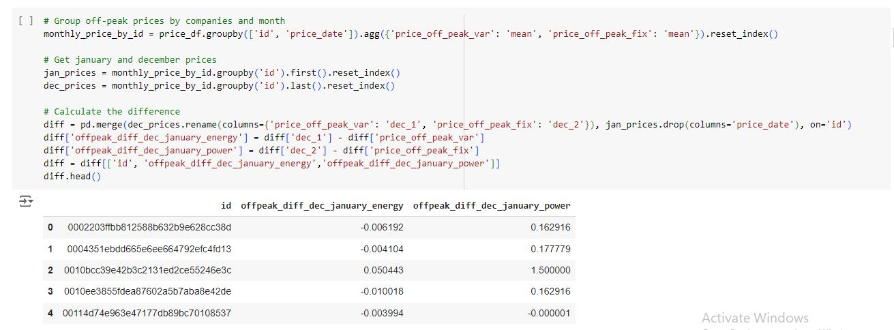

# Feature Engineering & Data Transformation

This section covers the **Feature Engineering** and **Data Transformation** steps applied in the project to prepare the dataset for analysis and model training.

## Overview

Feature engineering and data transformation are crucial steps in building a robust machine learning model. These processes help improve the performance of the model by creating new features, modifying existing ones, and ensuring the dataset is in the correct format for training.

Key steps in this notebook include:.
- Creating new features based on domain knowledge.
- Encoding categorical variables.
- Normalizing/Standardizing numerical features
- Transforming skewed distributions.

## Key Transformations
1. **Feature Creation:**
   - Difference Between Off-Peak Prices in December and Preceding January
     This feature was created to determine price changes across the entire year for each company. It helps to capture significant fluctuations in energy prices between December and the        preceding January, revealing potential seasonal patterns.

     
     
   
2. **Encoding Categorical Variables:**
   - One-hot encoding and label encoding for categorical data.
   
3. **Feature Scaling:**
   - Standardization (Z-score scaling) and normalization (min-max scaling).
   
4. **Feature Creation:**
   - Creating interaction terms, polynomial features, or domain-specific transformations.

## Notebook

The detailed code and explanations for the feature engineering and data transformation steps can be found in the Jupyter Notebook:

You can also view the notebook directly in Google Colab using the badge below:

## Libraries Used
- `pandas` for data manipulation.
- `scikit-learn` for transformations like encoding and scaling.
- `numpy` for numerical computations.

## Next Steps
Once the dataset is transformed, it is ready for the next step: **Model Training & Evaluation**. Check out the [model training notebook](./link_to_model_training_notebook.ipynb) for more details.

