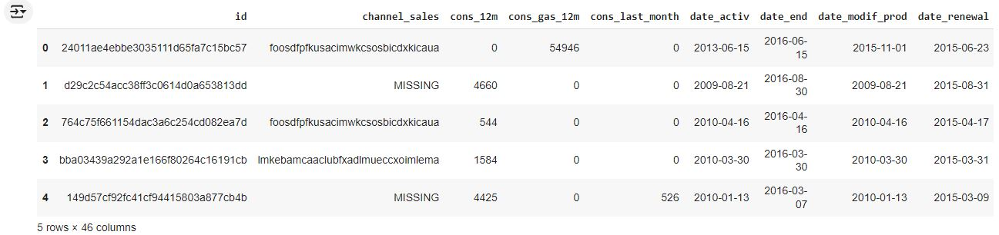

# Feature Engineering & Data Transformation

This section covers the **Feature Engineering** and **Data Transformation** steps applied in the project to prepare the dataset for analysis and model training.

## Overview

Feature engineering and data transformation are crucial steps in building a robust machine learning model. These processes help improve the performance of the model by creating new features, modifying existing ones, and ensuring the dataset is in the correct format for training.

Key steps in this notebook include:.
- Creating new features based on domain knowledge.
- Encoding categorical variables.
- Normalizing/Standardizing numerical features
- Transforming skewed distributions.

## Key Transformations
1. **Feature Creation:**
   - **Difference Between Off-Peak Prices in December and Preceding January**
     This feature was created to determine price changes across the entire year for each company. It helps to capture significant fluctuations in energy prices between December and the        preceding January, revealing potential seasonal patterns.
     
     ```python
     # Group off-peak prices by companies and month
      monthly_price_by_id = price_df.groupby(['id', 'price_date']).agg({'price_off_peak_var': 'mean', 'price_off_peak_fix': 'mean'}).reset_index()
      
      # Get january and december prices
      jan_prices = monthly_price_by_id.groupby('id').first().reset_index()
      dec_prices = monthly_price_by_id.groupby('id').last().reset_index()
      
      # Calculate the difference
      diff = pd.merge(dec_prices.rename(columns={'price_off_peak_var': 'dec_1', 'price_off_peak_fix': 'dec_2'}), jan_prices.drop(columns='price_date'), on='id')
      diff['offpeak_diff_dec_january_energy'] = diff['dec_1'] - diff['price_off_peak_var']
      diff['offpeak_diff_dec_january_power'] = diff['dec_2'] - diff['price_off_peak_fix']
      diff = diff[['id', 'offpeak_diff_dec_january_energy','offpeak_diff_dec_january_power']]
      diff.head()
     ```

     

     ```python
     # Merging the engineered feature
     df = pd.merge(df, diff, on='id')
     df.head()
     ```

     

   - **Average Price Changes Across Different Periods**

     This feature provides more granularity by looking at the mean price differences between off-peak, peak, and mid-peak periods. It may reveal patterns across shorter timeframes            (monthly or seasonal fluctuations) that the December-January difference feature might miss.

     ```python
       # Aggregate average prices per period by company
         mean_prices = price_df.groupby(['id']).agg({
             'price_off_peak_var': 'mean', 
             'price_peak_var': 'mean', 
             'price_mid_peak_var': 'mean',
             'price_off_peak_fix': 'mean',
             'price_peak_fix': 'mean',
             'price_mid_peak_fix': 'mean'    
         }).reset_index()
       
       # Calculate the mean difference between consecutive periods
         mean_prices['off_peak_peak_var_mean_diff'] = mean_prices['price_off_peak_var'] - mean_prices['price_peak_var']
         mean_prices['peak_mid_peak_var_mean_diff'] = mean_prices['price_peak_var'] - mean_prices['price_mid_peak_var']
         mean_prices['off_peak_mid_peak_var_mean_diff'] = mean_prices['price_off_peak_var'] - mean_prices['price_mid_peak_var']
         mean_prices['off_peak_peak_fix_mean_diff'] = mean_prices['price_off_peak_fix'] - mean_prices['price_peak_fix']
         mean_prices['peak_mid_peak_fix_mean_diff'] = mean_prices['price_peak_fix'] - mean_prices['price_mid_peak_fix']
         mean_prices['off_peak_mid_peak_fix_mean_diff'] = mean_prices['price_off_peak_fix'] - mean_prices['price_mid_peak_fix']

       columns = [
          'id', 
          'off_peak_peak_var_mean_diff',
          'peak_mid_peak_var_mean_diff', 
          'off_peak_mid_peak_var_mean_diff',
          'off_peak_peak_fix_mean_diff', 
          'peak_mid_peak_fix_mean_diff', 
          'off_peak_mid_peak_fix_mean_diff'
         ]
         df = pd.merge(df, mean_prices[columns], on='id')
         df.head()
       ```

     

   - **Tenure**

     How long a company has been a client of PowerCo.

       ```python
       df['tenure'] = ((df['date_end'] - df['date_activ'])/ np.timedelta64(1, 'D')/ 365.25).astype(int)
       df.groupby(['tenure']).agg({'churn': 'mean'}).sort_values(by='churn', ascending=False).head(3)
       ```

     

     Companies who have only been a client for 4 or less months are much more likely to churn compared to companies that have been a client for longer. Interestingly, the difference          between 4 and 5 months is about 4%, which represents a large jump in likelihood for a customer to churn compared to the other differences between ordered tenure values. Perhaps          this reveals that getting a customer to over 4 months tenure is actually a large milestone with respect to keeping them as a long term customer.

     This is an interesting feature to keep for modelling because clearly how long you've been a client, has a influence on the chance of a client churning.
   
2. **Transforming dates into months:**

   Dates as a datetime object are not useful for a predictive model, so we needed to use the datetimes to create some other features that may hold some predictive power.

   - Using intuition, you could assume that a client who has been an active client of PowerCo for a longer amount of time may have more loyalty to the brand and is more likely to stay.       Whereas a newer client may be more volatile. Hence the addition of the months_activ feature.
   
   - As well as this, if we think from the perspective of a client with PowerCo, if you're coming toward the end of your contract with PowerCo your thoughts could go a few ways. You          could be looking for better deals for when your contract ends, or you might want to see out your contract and sign another one. One the other hand if you've only just joined, you        may have a period where you're allowed to leave if you're not satisfied. Furthermore, if you're in the middle of your contract, their may be charges if you wanted to leave,              deterring clients from churning mid-way through their agreement. So, I think months_to_end will be an interesting feature because it may reveal patterns and behaviours about timing      of churn.
   
   - My belief is that if a client has made recent updates to their contract, they are more likely to be satisfied or at least they have received a level of customer service to update        or change their existing services. I believe this to be a positive sign, they are an engaged customer, and so I believe months_modif_prod will be an interesting feature to include       because it shows the degree of how 'engaged' a client is with PowerCo.
   
   - Finally the number of months since a client last renewed a contract I believe will be an interesting feature because once again, it shows the degree to which that client is              engaged. It also goes a step further than just engagement, it shows a level of commitment if a client renews their contract. For this reason, I believe months_renewal will be a          good feature to include.

   ```python
   # Converting dates to months
   def convert_months(reference_date, df, column):
       """
       Input a column with timedeltas and return months
       """
       time_delta = reference_date - df[column]
       months = ((time_delta / np.timedelta64(1, 'D'))/ 30.44).astype(int)
       return months

   # Create reference date
   reference_date = datetime(2016, 1, 1)
   
   # Create columns
   df['months_activ'] = convert_months(reference_date, df, 'date_activ')
   df['months_to_end'] = -convert_months(reference_date, df, 'date_end')
   df['months_modif_prod'] = convert_months(reference_date, df, 'date_modif_prod')
   df['months_renewal'] = convert_months(reference_date, df, 'date_renewal')

   # We no longer need the datetime columns that we used for feature engineering, so we can drop them
   remove = [
       'date_activ',
       'date_end',
       'date_modif_prod',
       'date_renewal'
   ]
   
   df = df.drop(columns=remove)
   df.head()
   ```
   
   

3. **Transforming Boolean data:**

   has_gas
   Transforming columns from being categorical to being a binary flag

   ```python
   df['has_gas'] = df['has_gas'].replace(['t', 'f'], [1, 0])
   df.groupby(['has_gas']).agg({'churn': 'mean'})
   ```
   

   If a customer also buys gas from PowerCo, it shows that they have multiple products and are a loyal customer to the brand. Hence, it is no surprise that customers who do not buy gas     are almost 2% more likely to churn than customers who also buy gas from PowerCo. Hence, this is a useful feature.


4. **Transforming categorical data:**

   To encode categorical features, dummy variables AKA one hot encoding is used. This create a new feature for every unique value of a categorical column, and fills this column with        either a 1 or a 0 to indicate that this company does or does not belong to this category.

   channel_sales

   ```python
   # Transform into categorical type
   df['channel_sales'] = df['channel_sales'].astype('category')
   
   # How many categories are within this column
   df['channel_sales'].value_counts()
   ```

   

   The last 3 categories in the output above, show that they only have 11, 3 and 2 occurrences respectively. Considering that the dataset has about 14000 rows, this means that these        dummy variables will be almost entirely 0 and so will not add much predictive power to the model at all (since they're almost entirely a constant value and provide very little).

   For this reason, I dropped these 3 dummy variables.

   ```python
   df = pd.get_dummies(df, columns=['channel_sales'], prefix='channel')
   df = df.drop(columns=['channel_sddiedcslfslkckwlfkdpoeeailfpeds', 'channel_epumfxlbckeskwekxbiuasklxalciiuu', 'channel_fixdbufsefwooaasfcxdxadsiekoceaa'])
   df.head()
   ```

   

4. **Handling skewness:**

   The reason why we need to treat skewness is because some predictive models have inherent assumptions about the distribution of the features that are being supplied to it. Such models    are called parametric models, and they typically assume that all variables are both independent and normally distributed.

   There are many ways that you can treat skewed variables. You can apply transformations such as:

   - Square root
   - Cubic root
   - Logarithm
     
   For this case I used the 'Logarithm' transformation for the positively skewed features.

   ```python
   skewed = [
    'cons_12m', 
    'cons_gas_12m', 
    'cons_last_month',
    'forecast_cons_12m', 
    'forecast_cons_year', 
    'forecast_discount_energy',
    'forecast_meter_rent_12m', 
    'forecast_price_energy_off_peak',
    'forecast_price_energy_peak', 
    'forecast_price_pow_off_peak'
]

df[skewed].describe()
```


The standard deviation for most of these features is quite high.

```python
# Apply log10 transformation
df["cons_12m"] = np.log10(df["cons_12m"] + 1)
df["cons_gas_12m"] = np.log10(df["cons_gas_12m"] + 1)
df["cons_last_month"] = np.log10(df["cons_last_month"] + 1)
df["forecast_cons_12m"] = np.log10(df["forecast_cons_12m"] + 1)
df["forecast_cons_year"] = np.log10(df["forecast_cons_year"] + 1)
df["forecast_meter_rent_12m"] = np.log10(df["forecast_meter_rent_12m"] + 1)
df["imp_cons"] = np.log10(df["imp_cons"] + 1)

df[skewed].describe()
```


For the majority of the features, their standard deviation is much lower after transformation. This is a good thing, it shows that these features are more stable and predictable now.

```python
fig, axs = plt.subplots(nrows=3, figsize=(18, 20))
# Plot histograms
sns.distplot((df["cons_12m"].dropna()), ax=axs[0])
sns.distplot((df[df["has_gas"]==1]["cons_gas_12m"].dropna()), ax=axs[1])
sns.distplot((df["cons_last_month"].dropna()), ax=axs[2])
plt.show()
```


## Notebook

The detailed code and explanations for the feature engineering and data transformation steps can be found in the Jupyter Notebook:

[](https://colab.research.google.com/drive/1j4COMSVI1q5uULsLL9oGTZLM23ifbVAo#scrollTo=6JVJsvLPj9zl)

You can also view the notebook directly in Google Colab using the badge below:

[](https://colab.research.google.com/drive/1j4COMSVI1q5uULsLL9oGTZLM23ifbVAo#scrollTo=6JVJsvLPj9zl)


## Next Steps
Once the dataset is transformed, it is ready for the next step: **Model Training & Evaluation**. Check out the [model training notebook](./link_to_model_training_notebook.ipynb) for more details.

